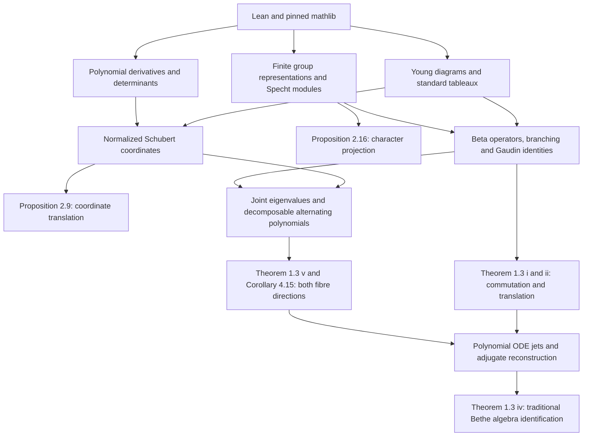

# Karp–Purbhoo formalization map

## Specification and exact signatures

The source is Karp–Purbhoo, *Universal Plücker coordinates for the Wronski map and
positivity in real Schubert calculus*, JAMS, in press,
[10.1090/jams/1087](https://doi.org/10.1090/jams/1087), and
[arXiv:2309.04645v2](https://arxiv.org/abs/2309.04645v2).
The README coverage table is the release scope, using the arXiv v2 numbering.
[KPResults.lean](verification/KPResults.lean) checks every public result listed
there and prints its full Lean signature and transitive logical dependencies.

This is an extraction milestone: no mathematical result or stronger hypothesis
was added. Existing support comes from the pinned mathlib and the exact source
modules listed in [source-manifest.json](verification/source-manifest.json).

## Dependency overview

This is a mathematical overview; every direct module import is also recorded
in the source manifest. The build checks that all local imports are present.

## Proof choices and divergences

1. **Proposition 2.9:** the proof uses derivatives of determinant minors,
   addition of Young-diagram boxes, the standard skew-tableau recurrence and
   finite polynomial Taylor expansion. This gives the exact translation
   coefficients and normalization, with basis independence proved internally.
   It replaces an invocation of the cited proposition by a direct proof.
2. **Proposition 2.16:** the finite-group proof constructs the character-weighted
   operator, uses proved character orthogonality and semisimplicity, identifies
   the isotypic component with the sum of actual irreducible copies, and proves
   equality with its orthogonal projection. The Specht specialization uses the
   constructed irreducible representation and its standard-tableau dimension.
3. **Theorem 1.3(v) / Corollary 4.15:** the interface is the exact form required
   by Smallram. A nonzero common scalar-action subspace produces a Schubert
   space with the prescribed monic Wronskian and normalized coordinates;
   every point in that fibre yields such a subspace. The reverse direction
   uses polynomial equations, Schubert charts and specialization. No distinct-root
   or generic-parameter hypothesis is added. Maximal-eigenspace uniqueness and
   scheme multiplicities are not assertions of this interface.
4. **Theorem 1.3(iv):** the traditional algebra is defined independently by
   actual single-column operators at all centers, equivalently their polynomial
   coefficients. The reverse inclusion uses a finite polynomial initial-value
   matrix and its adjugate. A denominator-cleared identity is established on
   positive real tuples using joint decomposition and the faithful Specht family,
   then extended to all complex parameters by polynomial extensionality.
   Translation covers parameters for which the initial scalar determinant
   vanishes. This replaces a literature-supplied inverse fundamental differential
   operator by a proved finite reconstruction.

The original detailed proof history is available in
[Smallram's formalization map at the extraction commit](https://github.com/zhangteng2000/Smallram/blob/e92e33137405545c528c546e4a2e4f9103c63dfb/FORMALIZATION_MAP.md).
Historical incomplete checkpoints there are superseded by its completed M7 gate.

## Acceptance gate

Run `python3 scripts/verify.py`. Publication requires a successful `lake build`,
an exact import-closure and source-hash check, a project-source placeholder scan,
a recursive audit of all imported project declarations, and explicit signature
and dependency checks for the KP entry points. Only Lean's `Classical.choice`,
`propext`, and `Quot.sound` may occur as foundational logical dependencies.
